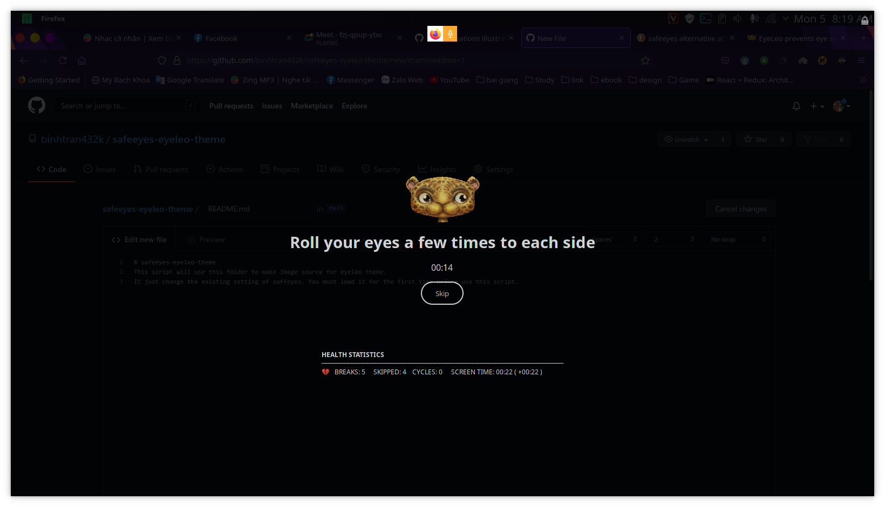

# safeeyes-eyeleo-theme
This script will use this folder to make image source for eyeleo theme.

It just change the existing setting of saffeyes. You must load it for the first time before use this script.
## Installation guide
`python install_config.py`

Then restart safeeyes and enjoys the result

## Example:

